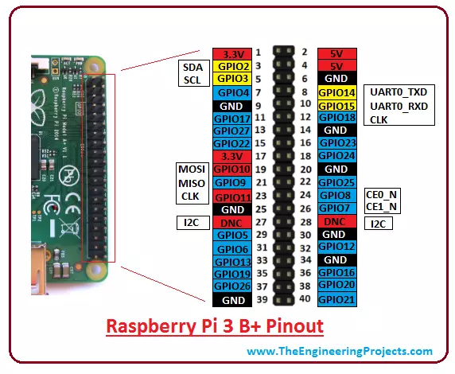

# IOT-notes

## Arduino

**communication**
- 단방향 통신: 시리얼 통신
- 양방향 통신: SPI, I2C, CAN 등

### Arduino I2C

> I2C (Inter-Integrated Circuit) is a serial bus interface connection protocol. It is also called a TWI (two wire interface) since it uses only two wires for communication. Those two wires are SDA (serial data) and SCL (serial clock).

> I2C is an acknowledgment-based communication protocol i.e. transmitter checks for an acknowledgment from the receiver after transmitting data to know whether data is received by the receiver successfully

I2C works in two modes namely,
- Master mode
- Slave mode

SDA (serial data) wire is used for data exchange in between the master and slave device.

SCL (serial clock) is used for the synchronous clock in between master and slave device.

[more](https://www.electronicwings.com/arduino/arduino-i2c)

## Raspberry pi 3b+

